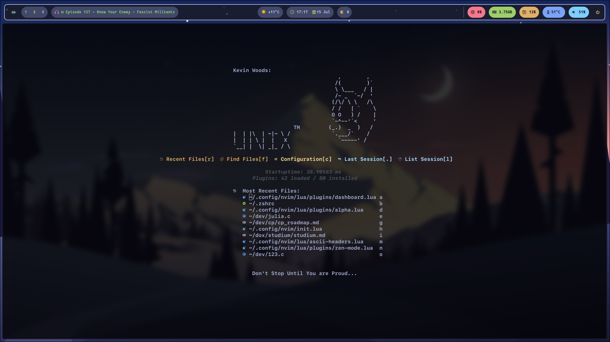

### Installation

To install your Neovim configuration, you can follow these steps:

1. Clone the repository into your Neovim config directory:

```bash
git clone https://github.com/znkkw/neovim ~/.config/nvim
```

2. Make sure you have the required tools and dependencies installed using `yay`:

```bash
paru -S --needed \
   neovim python-pynvim nodejs npm ripgrep fzf fd bat treesitter-cli curl ueberzugpp imagemagick lua51
```

3. Make sure to checkhealth

Inside nvim

```
:checkhealth
```

The below command makes sure you have magick installed that is required by [image.nvim](https://github.com/3rd/image.nvim)
```bash
luarocks --local --lua-version=5.1 install magick
```
### Dashboard

